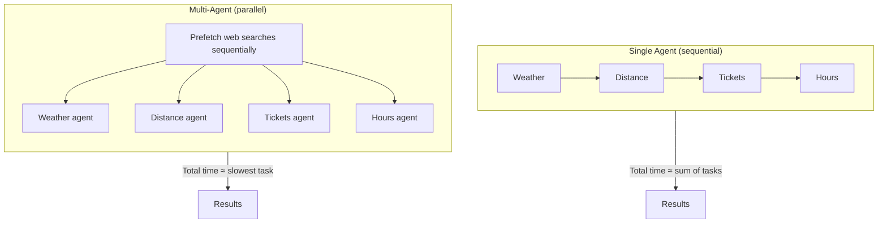

# SF Zoo — Single Agent vs Multi-Agent Demo

A Python demo that compares two agent architectures for gathering real-time information about the [San Francisco Zoo](https://www.sfzoo.org/):

- **Single agent** — one model handles four tasks sequentially
- **Multi-agent** — four specialized sub-agents run in parallel, each focused on one task

Both approaches use **hosted open-source models** in the cloud (no local GPU or model download). The script measures latency per task and overall, then prints a side-by-side comparison.

## Tasks

| Task | What it fetches |
|------|-----------------|
| Weather | Current conditions and temperature at the SF Zoo |
| Distance | Driving distance and time from Union Square to the zoo |
| Tickets | Adult general admission price (USD) |
| Hours | Today's opening hours and seasonal notes |

## Providers

| Provider | Sign up | Best for | Web search | Free tier |
|----------|---------|----------|------------|-----------|
| **[Groq](https://console.groq.com/)** ⭐ Recommended | [console.groq.com](https://console.groq.com/) | Fast inference, Compound built-in search | Built-in on Compound models | Yes |
| **[OpenRouter](https://openrouter.ai/)** | [openrouter.ai](https://openrouter.ai/) | One API key, 300+ models | DuckDuckGo (automatic) | Free `:free` models |

### Models

| Provider | Model ID | Web search | Notes |
|----------|----------|------------|-------|
| Groq | `groq/compound-mini` | Built-in | **Default for single-agent** — open models + server-side search |
| Groq | `groq/compound` | Built-in | More capable, higher cost |
| Groq | `llama-3.3-70b-versatile` | DuckDuckGo | Used in multi-agent split |
| OpenRouter | `meta-llama/llama-3.3-70b-instruct:free` | DuckDuckGo | No credits needed |
| OpenRouter | `meta-llama/llama-3.3-70b-instruct` | DuckDuckGo | Paid — requires credits |

## Architecture



**Single agent:** Four sequential API calls on one model. Total latency ≈ sum of all tasks.

**Multi-agent:** Web searches run first (sequential), then four LLM calls run in parallel. Total latency ≈ slowest single task.

### Groq optimizations (built-in)

The script includes several strategies to avoid Groq rate limits (429) and payload errors (413):

| Strategy | What it does |
|----------|--------------|
| **Model split** | Multi-agent uses a different Groq model per task (separate TPM buckets) |
| **Dual API keys** | Tasks round-robin across `GROQ_API_KEY` and `GROQ_API_KEY_2` |
| **Cooldown pause** | 60s wait between single-agent and multi-agent runs |
| **Staggered launch** | 3s delay between starting each parallel sub-agent |
| **Sequential search** | DuckDuckGo prefetch before parallel LLM calls (avoids SSL/thread errors) |
| **429 retry** | Auto-retries with the alternate API key on rate-limit errors |

**Multi-agent model + key assignment (Groq):**

| Task | Model | API key |
|------|-------|---------|
| Weather | `llama-3.1-8b-instant` | key #1 |
| Distance | `gemma2-9b-it` | key #2 |
| Tickets | `llama-3.3-70b-versatile` | key #1 |
| Hours | `qwen/qwen3-32b` | key #2 |

Single-agent uses `groq/compound-mini` with built-in web search on all four tasks.

## Prerequisites

- Python 3.10+
- API key from [Groq](https://console.groq.com/) and/or [OpenRouter](https://openrouter.ai/)

## Quick start

```bash
pip install -r requirements.txt
```

Create a `.env` file in the project root (gitignored):

```bash
# Groq (recommended)
GROQ_API_KEY=your-primary-key
GROQ_API_KEY_2=your-secondary-key
LLM_PROVIDER=groq
LLM_MODEL=groq/compound-mini

# Optional tuning
PAUSE_BETWEEN_RUNS_SEC=60
SPLIT_MULTI_AGENT_MODELS=true
MULTI_AGENT_STAGGER_SEC=3
```

Run:

```bash
python sf_zoo_agent_comparison.py
```

### OpenRouter instead

```bash
OPENROUTER_API_KEY=your-key-here
LLM_PROVIDER=openrouter
LLM_MODEL=meta-llama/llama-3.3-70b-instruct:free
```

> Paid OpenRouter models (without `:free`) require credits at [openrouter.ai/settings/credits](https://openrouter.ai/settings/credits).

## Example output

```
🦁  SF Zoo — Single Agent vs Multi-Agent Demo
    Provider: groq  |  Single model: groq/compound-mini
    API keys:  2 Groq keys (load-balanced)
    Multi:    split across 4 models
    Search:   built-in web search
    Tasks: weather · distance · tickets · hours

════════════════════════════════════════════════════════════
  SINGLE AGENT  (sequential)
════════════════════════════════════════════════════════════

  API keys: 2 (round-robin per task)
  → 🌤  Weather at SF Zoo [key #1] … ✓ (4200 ms)
  ...

  ⏳  Pausing 60s between runs (rate-limit cooldown) …
  ✓  Cooldown complete — starting multi-agent run.

════════════════════════════════════════════════════════════
  MULTI-AGENT  (parallel, 4 sub-agents)
════════════════════════════════════════════════════════════

  Model + key split (one per task):
    🌤  Weather at SF Zoo          → llama-3.1-8b-instant  (key #1)
    📍 Distance from downtown SF   → gemma2-9b-it          (key #2)
    ...

  Prefetching web searches (sequential) …
    → 🌤  Weather at SF Zoo … ✓
    ...

════════════════════════════════════════════════════════════
  COMPARISON SUMMARY
════════════════════════════════════════════════════════════
  Total latency                      15200ms     4200ms
  Speed advantage                         —      3.6×
```

## Configuration

All settings are loaded from `.env` via `python-dotenv`.

| Variable | Default | Description |
|----------|---------|-------------|
| `LLM_PROVIDER` | `openrouter` | `groq` or `openrouter` |
| `LLM_MODEL` | Provider default | Model for single-agent (`groq/compound-mini` or `:free` variant) |
| `GROQ_API_KEY` | — | Primary Groq API key |
| `GROQ_API_KEY_2` | — | Second Groq key (round-robin + failover on 429) |
| `GROQ_API_KEY_3` … | — | Additional keys supported |
| `OPENROUTER_API_KEY` | — | Required when `LLM_PROVIDER=openrouter` |
| `PAUSE_BETWEEN_RUNS_SEC` | `60` | Cooldown between single- and multi-agent runs (`0` to skip) |
| `SPLIT_MULTI_AGENT_MODELS` | `true` | Use a different model per multi-agent task |
| `MULTI_AGENT_STAGGER_SEC` | `3` | Seconds between launching parallel sub-agents |
| `SEARCH_MAX_RESULTS` | `3` | DuckDuckGo results per query |
| `SEARCH_SNIPPET_CHARS` | `280` | Max characters per search snippet |

Edit `TASKS` and `MAX_TOKENS` in `sf_zoo_agent_comparison.py` to customize prompts.

## How it works

1. **`create_clients`** — Loads one or more API keys and builds OpenAI-compatible clients.
2. **`run_single_agent`** — Runs four tasks sequentially, alternating API keys when multiple are configured.
3. **`pause_between_runs`** — Waits for Groq TPM limits to reset.
4. **`prefetch_prompts`** — Fetches all DuckDuckGo results sequentially before parallel LLM calls.
5. **`run_multi_agent`** — Launches four sub-agents in a thread pool, each with its own model and API key.
6. **`call_model_with_retry`** — Retries on 429, switching to the alternate API key when available.
7. **`print_comparison`** — Computes speedup and prints per-task winners.

## Troubleshooting

| Error | Cause | Fix |
|-------|-------|-----|
| **402 Insufficient credits** (OpenRouter) | Paid model without credits | Use `meta-llama/llama-3.3-70b-instruct:free` or add credits |
| **413 Request too large** (Groq Compound) | Compound payloads are heavy | Multi-agent already uses lighter models + DuckDuckGo; keep `SPLIT_MULTI_AGENT_MODELS=true` |
| **429 Rate limit** (Groq) | TPM/RPM exceeded | Add `GROQ_API_KEY_2`, increase `PAUSE_BETWEEN_RUNS_SEC`, or raise `MULTI_AGENT_STAGGER_SEC` |
| **Unsupported protocol version 0x304** | Parallel DuckDuckGo searches | Fixed — searches now prefetch sequentially before LLM calls |

## Trade-offs

| | Single agent | Multi-agent |
|---|-------------|-------------|
| **Latency** | Higher (sequential) | Lower (parallel) |
| **API calls** | 4 | 4 |
| **Context focus** | One model, many tasks | One task per sub-agent |
| **Complexity** | Simple | Thread pool + model/key split + search prefetch |
| **Rate limits** | Lower pressure | Higher — mitigated by split models, dual keys, stagger |

Multi-agent wins on wall-clock time when tasks are independent and I/O-bound. Single-agent is simpler and better when tasks depend on each other.

## Project structure

```
single-multi-agent/
├── .env                          # API keys (gitignored — create locally)
├── .gitignore
├── README.md
├── requirements.txt
└── sf_zoo_agent_comparison.py
```

## License

No license file is included. Add one if you plan to distribute or open-source this project.
