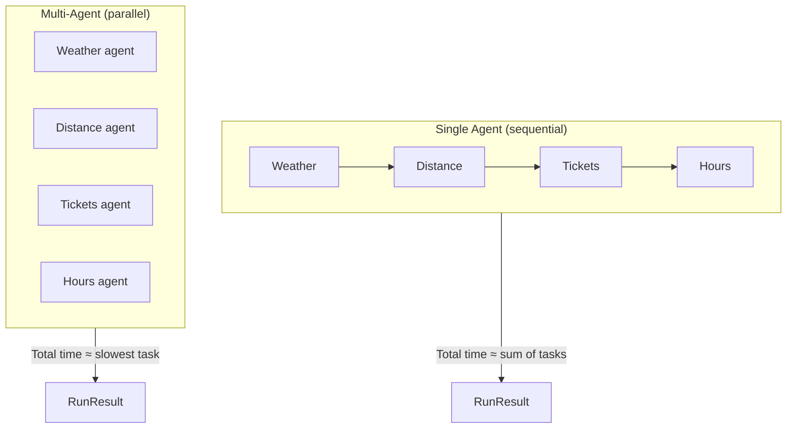

# SF Zoo — Single Agent vs Multi-Agent Demo

A Python demo that compares two agent architectures for gathering real-time information about the [San Francisco Zoo](https://www.sfzoo.org/):

- **Single agent** — one Claude instance handles four tasks sequentially
- **Multi-agent** — four specialized sub-agents run in parallel, each focused on one task

Both approaches use Claude with web search to fetch live data. The script measures latency per task and overall, then prints a side-by-side comparison.

## Tasks

| Task | What it fetches |
|------|-----------------|
| Weather | Current conditions and temperature at the SF Zoo |
| Distance | Driving distance and time from Union Square to the zoo |
| Tickets | Adult general admission price (USD) |
| Hours | Today's opening hours and seasonal notes |

## Architecture



**Single agent:** Each task is a separate API call in sequence. Total latency is roughly the sum of all four calls.

**Multi-agent:** A `ThreadPoolExecutor` launches four workers at once. Total latency is roughly the slowest single task, not the sum.

## Prerequisites

- Python 3.10+
- An [Anthropic API key](https://console.anthropic.com/) with access to Claude and the web search tool

## Setup

```bash
pip install anthropic
```

Set your API key:

```bash
export ANTHROPIC_API_KEY="your-key-here"
```

## Usage

```bash
python sf_zoo_agent_comparison.py
```

The script runs the single-agent flow first, then the multi-agent flow, and prints:

1. Per-task answers and latencies for each mode
2. A comparison table (total latency, speedup factor, per-task breakdown)
3. A short verdict on which approach was faster

### Example output (abbreviated)

```
🦁  SF Zoo — Single Agent vs Multi-Agent Demo
    Tasks: weather · distance · tickets · hours

════════════════════════════════════════════════════════════
  SINGLE AGENT  (sequential)
════════════════════════════════════════════════════════════

  → 🌤  Weather at SF Zoo … ✓ (4200 ms)
  → 📍 Distance from downtown SF … ✓ (3800 ms)
  ...

════════════════════════════════════════════════════════════
  MULTI-AGENT  (parallel, 4 sub-agents)
════════════════════════════════════════════════════════════

  ✓ [4100 ms]  🌤  Weather at SF Zoo
  ✓ [3900 ms]  📍 Distance from downtown SF
  ...

════════════════════════════════════════════════════════════
  COMPARISON SUMMARY
════════════════════════════════════════════════════════════
  Metric                             Single      Multi
  ──────────────────────────────────────────────────
  Total latency                      15200ms     4200ms
  Speed advantage                         —      3.6×
```

## Configuration

Edit constants at the top of `sf_zoo_agent_comparison.py`:

| Constant | Default | Description |
|----------|---------|-------------|
| `MODEL` | `claude-sonnet-4-6` | Claude model used for all calls |
| `MAX_TOKENS` | `1024` | Max tokens per response |
| `TASKS` | 4 zoo-related prompts | Task definitions (id, label, prompt) |

## How it works

1. **`call_claude`** — Sends a prompt to Claude with the `web_search` tool enabled and returns the text answer plus latency in milliseconds.

2. **`run_single_agent`** — Loops through `TASKS` and calls Claude once per task, sequentially.

3. **`run_multi_agent`** — Submits each task to a thread pool worker (`_run_task`). Results are collected as futures complete and reordered to match the original task list.

4. **`print_comparison`** — Computes speedup (`single_total / multi_total`) and prints per-task latency winners.

## Trade-offs

| | Single agent | Multi-agent |
|---|-------------|-------------|
| **Latency** | Higher (sequential) | Lower (parallel) |
| **API calls** | Same (4 calls) | Same (4 calls) |
| **Context focus** | One agent, many tasks | One task per agent |
| **Complexity** | Simpler orchestration | Thread pool + result merging |
| **Cost** | Similar token usage | Similar token usage; may run concurrently |

Multi-agent wins on wall-clock time when tasks are independent and I/O-bound (web search). Single-agent is simpler to reason about and may be preferable when tasks depend on each other or when parallel API rate limits are a concern.

## Project structure

```
single-multi-agent/
├── README.md
└── sf_zoo_agent_comparison.py   # Demo script (config, agents, comparison)
```

## License

No license file is included. Add one if you plan to distribute or open-source this project.
