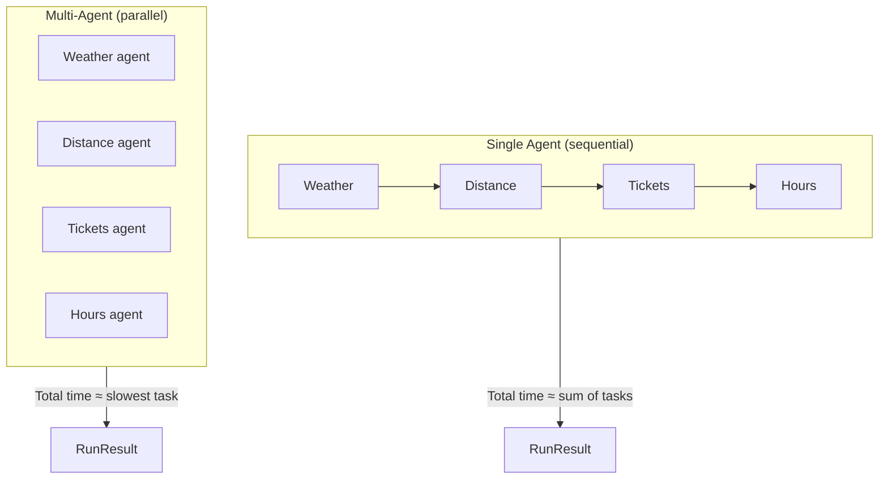

# SF Zoo — Single Agent vs Multi-Agent Demo

A Python demo that compares two agent architectures for gathering real-time information about the [San Francisco Zoo](https://www.sfzoo.org/):

- **Single agent** — one model handles four tasks sequentially
- **Multi-agent** — four specialized sub-agents run in parallel, each focused on one task

Both approaches use **hosted open-source models** over the internet (no local GPU or model download). The script measures latency per task and overall, then prints a side-by-side comparison.

## Tasks

| Task | What it fetches |
|------|-----------------|
| Weather | Current conditions and temperature at the SF Zoo |
| Distance | Driving distance and time from Union Square to the zoo |
| Tickets | Adult general admission price (USD) |
| Hours | Today's opening hours and seasonal notes |

## Hosted open-source providers (no local inference)

These providers run open models in the cloud. You only need an API key.

| Provider | Sign up | Best for | Built-in web search? | Free tier |
|----------|---------|----------|----------------------|-----------|
| **[OpenRouter](https://openrouter.ai/)** ⭐ Default | [openrouter.ai](https://openrouter.ai/) | One API key, 300+ models | No (uses DuckDuckGo) | Limited free models |
| **[Groq](https://console.groq.com/)** | [console.groq.com](https://console.groq.com/) | Fastest inference | Yes (`groq/compound-mini`) | Yes |

### Recommended models (all hosted, open-source)

| Provider | Model ID | Web search | Notes |
|----------|----------|------------|-------|
| OpenRouter | `meta-llama/llama-3.3-70b-instruct:free` | DuckDuckGo | **Default** — no credits needed |
| OpenRouter | `meta-llama/llama-3.3-70b-instruct` | DuckDuckGo | Paid — requires credits |
| OpenRouter | `deepseek/deepseek-chat-v3-0324` | DuckDuckGo | Strong reasoning, low cost |
| OpenRouter | `qwen/qwen-2.5-72b-instruct` | DuckDuckGo | Good general-purpose model |
| Groq | `groq/compound-mini` | Built-in | Llama + gpt-oss with server-side search |
| Groq | `groq/compound` | Built-in | More capable, higher cost |
| Groq | `llama-3.3-70b-versatile` | DuckDuckGo | Fast raw Llama, no agent tools |

> **Why OpenRouter?** One API key gives access to 300+ hosted open models. The script fetches live web results via DuckDuckGo, then asks the model to answer from those results.

## Architecture



**Single agent:** Each task is a separate API call in sequence. Total latency is roughly the sum of all four calls.

**Multi-agent:** A `ThreadPoolExecutor` launches four workers at once. Total latency is roughly the slowest single task, not the sum.

## Prerequisites

- Python 3.10+
- API key from one of the providers above

## Setup

```bash
pip install -r requirements.txt
```

### Option A — Groq (recommended, free tier + built-in web search)

Create a `.env` file in the project root (already gitignored):

```bash
GROQ_API_KEY=your-key-here
OPENROUTER_API_KEY=your-key-here
LLM_PROVIDER=groq
LLM_MODEL=groq/compound-mini
```

Then run:

```bash
python sf_zoo_agent_comparison.py
```

### Option B — OpenRouter (free model, no credits needed)

```bash
LLM_PROVIDER=openrouter
LLM_MODEL=meta-llama/llama-3.3-70b-instruct:free
python sf_zoo_agent_comparison.py
```

> Paid OpenRouter models (without `:free`) require credits at [openrouter.ai/settings/credits](https://openrouter.ai/settings/credits).

Change `LLM_PROVIDER` in `.env` to switch between Groq and OpenRouter.

## Usage

The script runs the single-agent flow first, then the multi-agent flow, and prints:

1. Per-task answers and latencies for each mode
2. A comparison table (total latency, speedup factor, per-task breakdown)
3. A short verdict on which approach was faster

### Example output (abbreviated)

```
🦁  SF Zoo — Single Agent vs Multi-Agent Demo
    Provider: groq  |  Model: groq/compound-mini
    Search:   built-in web search
    Tasks: weather · distance · tickets · hours

════════════════════════════════════════════════════════════
  SINGLE AGENT  (sequential)
════════════════════════════════════════════════════════════

  → 🌤  Weather at SF Zoo … ✓ (4200 ms)
  → 📍 Distance from downtown SF … ✓ (3800 ms)
  ...

════════════════════════════════════════════════════════════
  COMPARISON SUMMARY
════════════════════════════════════════════════════════════
  Total latency                      15200ms     4200ms
  Speed advantage                         —      3.6×
```

## Configuration

Set via environment variables:

| Variable | Default | Description |
|----------|---------|-------------|
| `LLM_PROVIDER` | `openrouter` | `openrouter` or `groq` |
| `LLM_MODEL` | Provider default | Model ID (see table above) |
| `OPENROUTER_API_KEY` | — | Required when provider is `openrouter` |
| `GROQ_API_KEY` | — | Required when provider is `groq` |
| `PAUSE_BETWEEN_RUNS_SEC` | `60` | Seconds to wait after single-agent run before multi-agent (helps Groq TPM limits; set `0` to skip) |

Edit `TASKS` and `MAX_TOKENS` in `sf_zoo_agent_comparison.py` to customize prompts.

## How it works

1. **`create_client`** — Builds an OpenAI-compatible client for the chosen provider.

2. **`build_prompt`** — For Compound models, sends the task directly (search runs server-side). For other models, fetches DuckDuckGo results and injects them into the prompt.

3. **`run_single_agent`** — Loops through `TASKS` sequentially.

4. **`run_multi_agent`** — Runs all four tasks in parallel via a thread pool.

5. **`print_comparison`** — Computes speedup and prints per-task winners.

## Trade-offs

| | Single agent | Multi-agent |
|---|-------------|-------------|
| **Latency** | Higher (sequential) | Lower (parallel) |
| **API calls** | Same (4 calls) | Same (4 calls) |
| **Context focus** | One agent, many tasks | One task per agent |
| **Complexity** | Simpler orchestration | Thread pool + result merging |
| **Cost** | Similar token usage | Similar; watch rate limits |

Multi-agent wins on wall-clock time when tasks are independent and I/O-bound (web search). Single-agent is simpler and may be preferable when tasks depend on each other or when parallel API rate limits are a concern.

**Groq rate limits:** The script pauses 60 seconds between the single-agent and multi-agent runs by default so token-per-minute (TPM) limits can reset. Set `PAUSE_BETWEEN_RUNS_SEC=0` in `.env` to disable.

## Project structure

```
single-multi-agent/
├── README.md
├── requirements.txt
└── sf_zoo_agent_comparison.py
```

## License

No license file is included. Add one if you plan to distribute or open-source this project.
